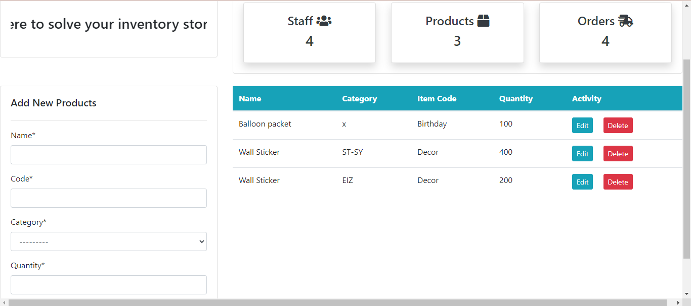
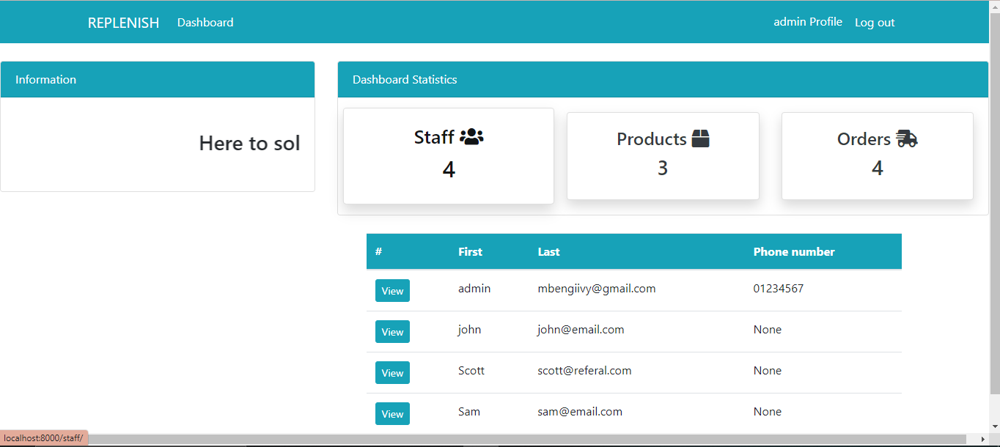
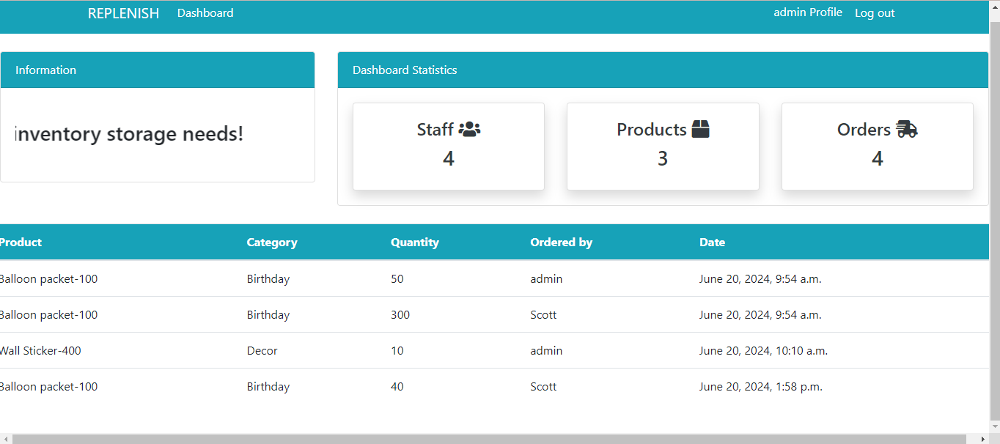

# REPLENISH- INVENTORY MANAGEMENT SYSTEM

Welcome to Replenish, a web application to suit your small business needs

## FUNCTIONALITIES:
- Storing your product list on a database
  

- Storing your staff members details on a database

  

- Keeping track of your product percentage and orders

  

- Allowing staff members to make requests to the admin to get some products

## EXPLANATION:

Imagine you are a small business owner. Replenish allows you as the business owner to track the items you have in storage. 
It also allows you to add staff members and as they register, they are allowed to access the system for themselves. 
Administrator privileges differ such that the business owner is considered the administrator and they are able to delete products and orders.
They also are able to access profile information for the staff members

This system is user friendly and very understanding

For sampling purposes, the administrative account details are as below:
Username: admin
Password: asdqwe!23
